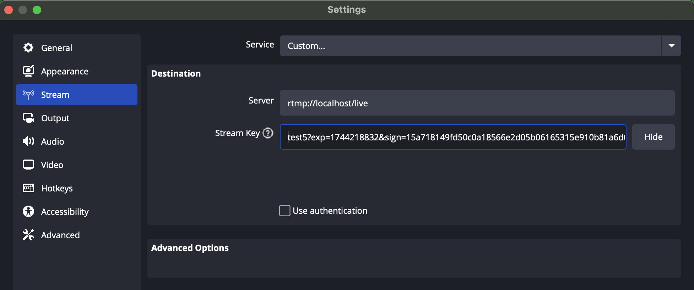

# mssd-ingestion Server

## Table of Contents

1. [Features](#features)
2. [Usage](#usage)
3. [Pre-requisites](#pre-requisites)
4. [Installation](#installation)
5. [Build the Project](#build-the-project)
6. [Generate HMAC Key](#generate-hmac-key)
7. [Start the Server](#start-the-server)
8. [Send Test Data to the Server](#send-test-data-to-the-server)
9. [HLS File Generation](#hls-file-generation)
10. [Test HLS Files with VLC](#test-hls-files-with-vlc)
11. [Example Workflow](#example-workflow)
12. [Notes](#notes)
13. [Contributing](#contributing)

The `RTMPServer` class provides functionality to handle Real-Time Messaging Protocol (RTMP) connections. This class
manages the server-side operations required to establish and maintain RTMP connections, process incoming streams, and
generate HLS (HTTP Live Streaming) files.

## Features

- RTMP Ingestion from OBS or any RTMP client.
- HLS (.m3u8 playlist + .ts segments) generation.
- Uploading generated HLS segments and manifests to Swarm.
- GSOC (Single Owner Chunk) support.
- Configurable environment for Swarm writer node, segment base URL, SOC parameters.
- HMAC-based RTMP stream key authentication.

## Usage

This project acts as a streaming ingestion server. Streams are sent to this server via OBS (RTMP), HLS segments are
generated and uploaded to Swarm.

## Pre-requisites

Ensure the following are installed on your system:

- [Node.js](https://nodejs.org/)
- [pnpm](https://pnpm.io/)
- [FFmpeg](https://ffmpeg.org/)
- Swarm Node (Bee)

## Installation

1. Clone the repository:

```bash
git clone https://github.com/Solar-Punk-Ltd/mssd-ingestion.git
cd mssd-ingestion
```

2. Install dependencies:

```bash
pnpm install
```

## Build the Project

To compile the TypeScript code into JavaScript, run:

```bash
pnpm build
```

## Generate HMAC Key

To generate a stream key, set the `RTMP_SECRET` environment variable. This key is used to sign the stream key for
security purposes.

```bash
export RTMP_SECRET=your_secret_key

or set in .env
or provide in during the command execuction
```

Then, generate the stream key using the following command:

```bash
(RTMP_SECRET=test) npm run generate-stream-key -- -s test -e 60
```

Output:

```bash
[time] [LOG] - OBS Stream Key: test?exp=1744276392&sign=6a22edfc68c073ab71dee70ce3f8907a20ab0795b958aa67499840e6483a80ab
[time] [LOG] - Full RTMP URL example: rtmp://localhost/live/test?exp=1744276392&sign=6a22edfc68c073ab71dee70ce3f8907a20ab0795b958aa67499840e6483a80ab
```

The generated stream key is a combination of the stream name, an expiration time, and an HMAC signature for security.
The `exp` parameter indicates the expiration time in seconds since the Unix epoch, and the `sign` parameter is the HMAC
signature.

You can add the generated stream key to the Stream Key field in OBS, for example:

```bash
test?exp=1744276392&sign=6a22edfc68c073ab71dee70ce3f8907a20ab0795b958aa67499840e6483a80ab
```



## Start the Server

Start the RTMP server by specifying the media root directory and, optionally, the FFmpeg binary path. If the FFmpeg
binary path is not provided, the system's default FFmpeg will be used:

```bash
node dist/index.js <MEDIAROOT_PATH> [<FFMPEG_PATH>]
```

> When starting the server, please ensure that ENVs are set.

```
WRITER_BEE_URL - Bee Node URL for uploading to Swarm

MANIFEST_SEGMENT_URL - Public URL of segments used in HLS manifest

GSOC_KEY - Private key to sign GSOC uploads

GSOC_TOPIC - Topic name for SOC uploads

STREAM_STAMP - Stamp to upload data to Swarm

RTMP_SECRET - HMAC secret for OBS stream key authentication
```

### Example

```bash
node dist/index.js ./media /opt/homebrew/bin/ffmpeg
```

## Send Test Data to the Server

You can use FFmpeg to generate a test video and stream it to the RTMP server:

```bash
ffmpeg -re -f lavfi -i testsrc=size=1280x720:rate=30 -f lavfi -i sine=frequency=1000 -c:v libx264 -preset veryfast -b:v 1500k -g 50 -c:a aac -b:a 128k -ar 44100 -f flv rtmp://localhost/live/test5?exp=1744219929&sign=c817ddc03ba825b9d0b5b64f6ca77f118d46ebf0bdc7e75743697d9421c5a340
```

This command generates a test video with a resolution of `1280x720` and a frame rate of `30 FPS`, along with a sine wave
audio track, and streams it to the RTMP server.

## HLS File Generation

The `RTMPServer` will generate HLS files (e.g., `.m3u8` playlist and `.ts` segments) in the specified `MEDIAROOT_PATH`.

## Test HLS Files with VLC

To test the generated HLS files:

1. Open VLC Media Player.
2. Go to **Media > Open File** or **Media > Open Network Stream**.
3. Point VLC to the `.m3u8` file in the `MEDIAROOT_PATH` directory or use the HTTP URL if the server is running:

```bash
http://localhost:8000/live/test/index.m3u8
```

## Example Workflow

1. **Start the Server**:

   ```bash
   node dist/index.js ./media /opt/homebrew/bin/ffmpeg
   ```

2. **Send Test Stream**:

   ```bash
   ffmpeg -re -f lavfi -i testsrc=size=1280x720:rate=30 -f lavfi -i sine=frequency=1000 -c:v libx264 -preset veryfast -b:v 1500k -g 50 -c:a aac -b:a 128k -ar 44100 -f flv rtmp://localhost/live/test
   ```

3. **Play the HLS Stream**:

   Open the `.m3u8` file in VLC or any HLS-compatible player:

   ```bash
   http://localhost:8000/live/test/index.m3u8
   ```

---

## Notes

- Ensure the `MEDIAROOT_PATH` directory is writable by the server.
- The FFmpeg binary must be executable and accessible at the specified path.
- The server monitors the media root's stream path for new segments. When a new segment appears, it uploads the segment
  to Swarm, then creates a new "live" manifest containing Swarm references. Finally, it uploads this manifest as a GSOC.
  The SOC access to this chunk allows the play of the stream via HLS.

## Contributing

Contributions are welcome! Please fork the repository and submit a pull request.

If you encounter any issues, feel free to open an issue on the
[GitHub repository](https://github.com/Solar-Punk-Ltd/mssd-ingestion).
